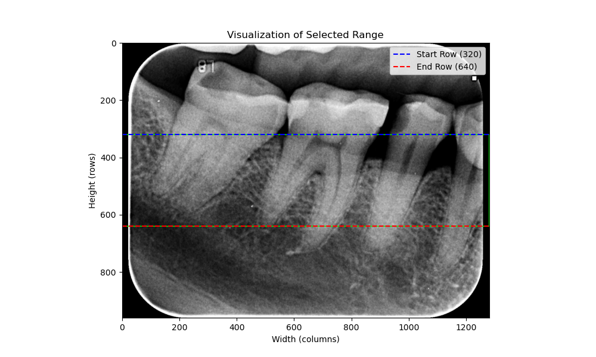

  
以上圖片主要分成三個部分去完成牙齒角度校正的工作，分別是：    
1. 初始設定：
- 確定起始的 max1, max2, ..., max𝑛，這些點來自影像第round(ℎ/3) 行。
- 初始化 𝑛個集合 Set1,Set2,…,Set𝑛，並將起始點加入對應集合。  
2. 點的追蹤：  
- 從roundround(ℎ/3)+1行到round(2ℎ/3)+1行，依序搜尋與上一次最近的最大點並加入集合。  

3. 線性回歸：  
- 對每個集合執行線性回歸以計算斜率 𝑚1,𝑚2,…,𝑚𝑛。  
- 計算每個集合對應的旋轉角度 deg1,deg2,…,deg𝑛。
- 最終的旋轉角度為這些角度的平均值。
